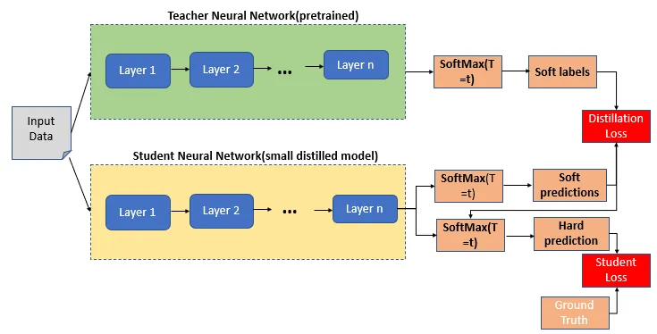

# Knowledge-Distillation
* Knowledge Distillation is a model-agnostic technique to compresses and transfers the knowledge from a computationally expensive large deep neural network(Teacher) to a single smaller neural work(Student) with better inference efficiency.</br>


* In this example, we will use a [BERT-base](https://huggingface.co/textattack/bert-base-uncased-SST-2) as Teacher and [BERT-Tiny](https://huggingface.co/google/bert_uncased_L-2_H-128_A-2) as Student.
* We will use [Text-Classification](https://huggingface.co/tasks/text-classification) as our task-specific knowledge distillation task and the [Stanford Sentiment Treebank v2 (SST-2)](https://paperswithcode.com/dataset/sst) dataset for training.
* They are two different types of knowledge distillation:
   - Task-specific knowledge distillation
   - Task-agnostic knowledge distillation
  
* In this example we are going to use the Task-specific knowledge distillation.
* In Task-specific knowledge distillation a "second step of distillation" is used to "fine-tune" the model on a given dataset. This idea comes from the [DistilBERT]() paper where it was shown that a student performed better than simply finetuning the distilled language model.

## How to run
To run fine-tuning of Teacher Model
```shell
python fine-tuning.py
```
To run Knowledge Distillation of Teacher and Student Model
```shell
python knowledge-distillation.py
```

